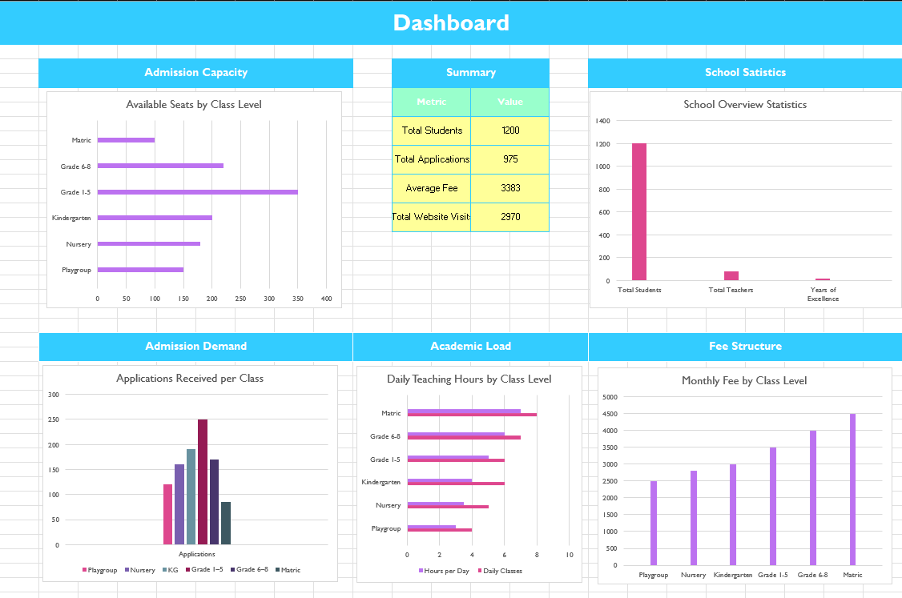

# School Admission Portal

**AICT Lab Project – Group Repository**

The School Admission Portal is a static, responsive website developed as part of the *Applications of Information and Communication Technology (AICT)* lab course. The project demonstrates the use of modern web technologies to present school information and manage admission-related details through a user-friendly interface.

---

## 📌 Project Overview

This website provides a digital platform for a school to:
- Present institutional information
- Display admission details
- Showcase campus facilities through a gallery
- Allow parents and students to contact the school easily

The project focuses on clean design, responsive layout, and structured content presentation.

---

## Project Files

- 📄 **Project Report (Word):**  
  [AICT_Project_Report.docx](Reports/AICT_Project_Report.docx)

- 📊 **Data Analysis (Excel):**  
  [AICT_Project_Data.xlsx](Reports/School_Admission_Portal_Data.xlsx)

- 📽️ **Presentation (PowerPoint):**  
  [AICT_Project_Presentation.pptx](docs/AICT_Project_Presentation.pptx)

---

## Screenshots

- Website Home Page  
  .png)

- Excel Dashboard  
  

---

## 🛠️ Technologies Used

- **HTML5** – Structure and content
- **CSS3** – Styling, layout, and responsiveness
- **Microsoft Excel** – Data analysis, calculations, and dashboard
- **GitHub Pages** – Website hosting and version control
- **Unsplash** - For Images used in Website

---

## 📂 Website Structure

| Page | Description |
|----|----|
| Home | Overview of the school and key highlights |
| About | School background, vision, and mission |
| Admissions | Admission details and academic levels |
| Gallery | Images showcasing school facilities and activities |
| Contact | Contact information and inquiry form |

---

## 📊 Data & Analysis

The project includes an Excel workbook that contains:
- Raw admission data
- Fee structure
- Timetable allocation
- Website usage analysis
- Calculations using SUM, AVERAGE, IF functions
- A summary dashboard with charts

All data used in Excel matches the figures presented on the website and in the project report.

---

## 🌐 Live Website

The website is hosted using **GitHub Pages** and can be accessed here:

🔗 **Live URL:**  
https://abudora-0.github.io/School_Admission_Portal/

---

## 👥 Group Members

- **Member 1:** Abdullah Akbar (Roll No 212)
- **Member 2:** Sarim Sajjad (Roll No 191)
- **Member 3:** Ali Khalid (Roll No 220)
- **Member 4:** Maaz Hassan (Roll No 202 )
- **Member 5:** Mujtaba Imtiaz (Roll No 192)

---

## 📖 How to Run Locally

1. Clone or download this repository
2. Open `index.html` in any modern web browser
3. Ensure all files and folders remain in their original structure

No additional software or server is required.

---

## 🧠 Learning Outcomes

- Practical application of AICT concepts
- Understanding of responsive web design
- Experience with data analysis using Excel
- Introduction to GitHub collaboration and hosting
- Improved teamwork and project documentation skills

---

## 📜 License

This project is developed for **academic purposes only** as part of the AICT Lab course.

---

© 2025 – AICT Lab Project  

